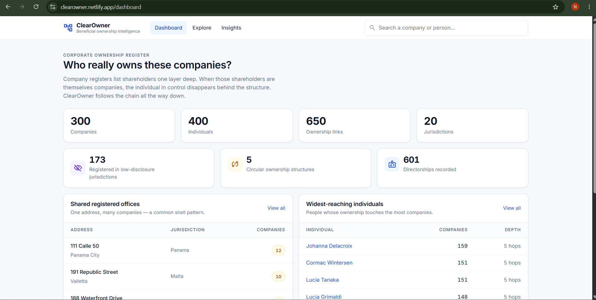
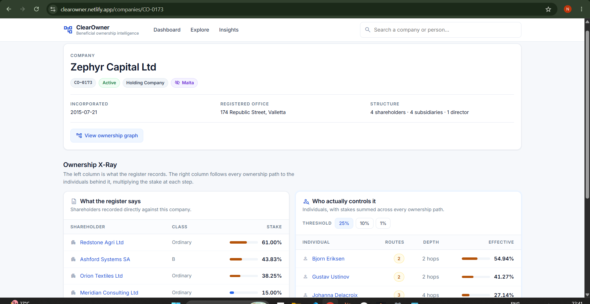
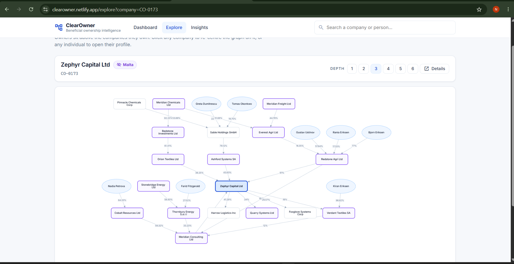
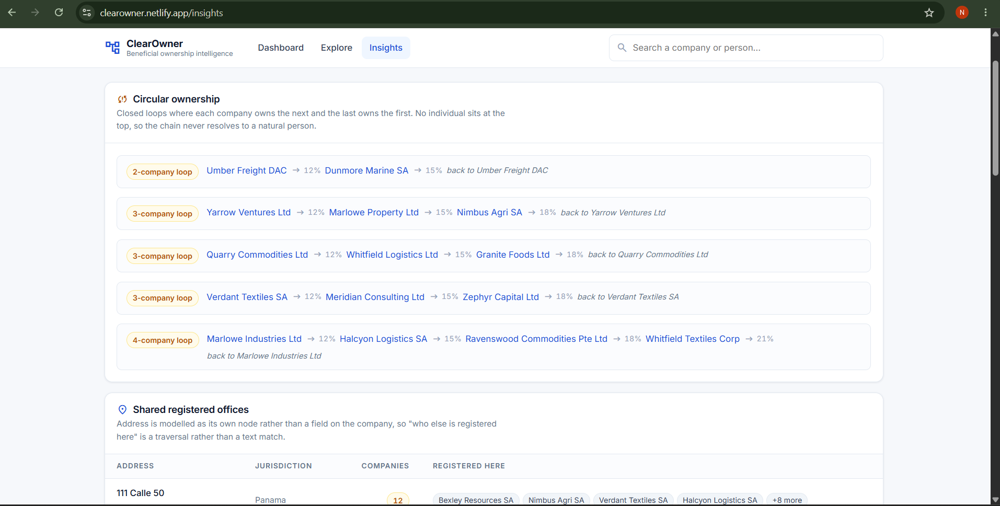
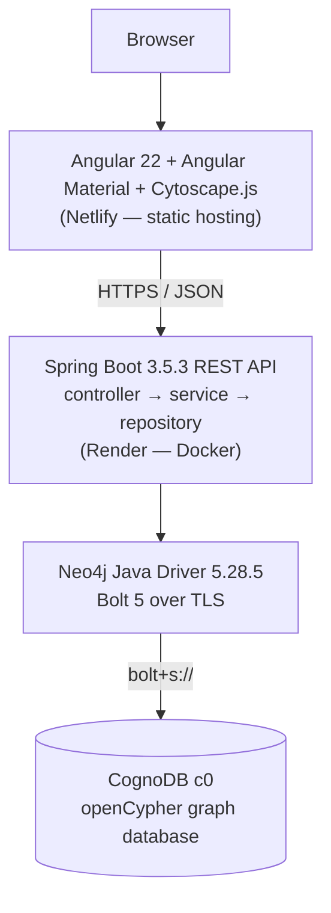
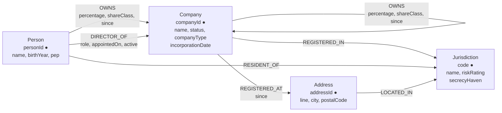

# ClearOwner

**Who really owns this company?**

A company register tells you a company's shareholders — one layer deep. When those
shareholders are themselves companies, the individual actually in control disappears
behind the structure. ClearOwner follows the chain to the end and works out who
holds what.

**Live demo:** https://clearowner.netlify.app
**API:** https://clearowner.onrender.com/api/health

> Synthetic dataset built for demonstration. Every company and person in it is
> generated. Nothing here is a statement about a real organisation or individual.

---

## Contents

- [The problem](#the-problem)
- [Why a graph database?](#why-a-graph-database)
- [Screenshots](#screenshots)
- [Architecture](#architecture)
- [Graph data model](#graph-data-model)
- [The important queries](#the-important-queries)
- [Setup](#setup)
- [Running locally](#running-locally)
- [Seed data](#seed-data)
- [Deployment](#deployment)
- [Technical decisions](#technical-decisions)
- [Working against CognoDB](#working-against-cognodb)
- [Known limitations](#known-limitations)

---

## The problem

Banks and regulated businesses are legally required to identify the **ultimate
beneficial owner** of a company before onboarding it — the natural person who
ultimately controls it. The EU Anti-Money Laundering Directives and the FATF
recommendations both set the reporting threshold at **25% ownership**, which is
why 25% is this application's default.

The difficulty is that registers record only direct shareholders. Consider a real
shape from the dataset — **Zephyr Capital Ltd**, registered in Malta:

**What the register says**

| Shareholder | Stake |
|---|---|
| Redstone Agri Ltd | 61.00% |
| Ashford Systems SA | 43.83% |
| Orion Textiles Ltd | 38.25% |
| Meridian Consulting Ltd | 15.00% |

Four companies. Not one human being.

**Who actually controls it**

| Individual | Effective stake | Routes | Depth |
|---|---|---|---|
| Bjorn Eriksen | 54.94% | 2 | 2 hops |
| Gustav Ustinov | 41.27% | 2 | 2 hops |
| Johanna Delacroix | 27.14% | 3 | 4 hops |

Johanna Delacroix appears nowhere on the company's own record. She reaches it
through three separate ownership paths, four layers down.

### How the number is calculated

Ownership multiplies along a chain. If **A owns 60% of B**, and **B owns 50% of C**,
then A effectively controls **30% of C**.

When the same person reaches a company by more than one route, the stakes **add**:

```
        Person P
        /       \
    60%/         \40%
      /           \
  Company A    Company B
      \           /
    50%\         /25%
        \       /
        Company C

P's effective stake in C = (0.60 × 0.50) + (0.40 × 0.25) = 30% + 10% = 40%
```

The `routes` column in the UI shows how many paths contributed. Anything above 1
means the register understates that person's position.

---

## Why a graph database?

The central operation is: **multiply the weight on every edge along a path of
unbounded depth, then aggregate per terminal node.** That is a path computation,
not a join.

### The honest comparison

This *is* expressible in PostgreSQL with a recursive CTE:

```sql
WITH RECURSIVE chain AS (
  SELECT owner_id, company_id, percentage / 100.0 AS share, 1 AS depth
  FROM ownership
  WHERE company_id = $1
  UNION ALL
  SELECT o.owner_id, c.company_id, c.share * o.percentage / 100.0, c.depth + 1
  FROM chain c
  JOIN ownership o ON o.company_id = c.owner_id
  WHERE c.depth < 8
)
SELECT owner_id, SUM(share) * 100 AS effective
FROM chain
GROUP BY owner_id
HAVING SUM(share) * 100 >= 25;
```

So the claim is not "impossible in SQL". The claim is that the graph is a
**better fit**, for four concrete reasons:

1. **The query is the shape of the question.** The Cypher reads as "follow OWNS
   from a person to this company" — six lines against fifteen, with no recursion
   scaffolding and no manual depth accounting.

2. **Traversal instead of repeated index lookups.** Each recursive step in SQL is
   another index probe into a growing `ownership` table. In a graph, relationships
   are stored with the node, so expanding a node's edges costs the same regardless
   of how large the dataset gets.

3. **Relationship properties are first-class.** `percentage` is a fact about the
   *link* between two entities, not about either entity. The model puts it exactly
   there, and `reduce()` consumes it directly off the path.

4. **Cycles are handled by the engine.** Circular ownership is real and does occur
   in the dataset. A recursive CTE loops forever without an explicit visited-set;
   the graph traversal will not revisit a node it has already crossed on a path.

### Where the graph earns the most

The `Address` node is the clearest modelling win. If a registered office were a
text column on `Company`, the question *"which other companies are registered
here?"* would be a string match on free text. As a node it is a two-hop traversal:

```
(Company)-[:REGISTERED_AT]->(Address)<-[:REGISTERED_AT]-(Company)
```

Twelve companies share one address in this dataset. That pattern is a well-known
shell-company indicator, and it falls out of the model for free.

### Where it earns the least

`sharedAddresses` is a `GROUP BY ... HAVING count(*) >= n`. A relational database
would find that trivial. It is included because it is genuinely useful to an
analyst, not because it demonstrates traversal.

---

## Screenshots

| Dashboard |
|---|
|  |

| Ownership X-Ray — register vs reality |
|---|
|  |

| Ownership graph explorer |
|---|
|  |

| Structural insights |
|---|
|  |

---

## Architecture



One backend service, three layers, no gateway and no second datastore. The seed
loader ships inside the same jar behind a `--seed` flag, so the project uses one
language, one driver and one configuration path.

```
clearowner/
├── backend/
│   └── src/main/java/ai/clearowner/
│       ├── config/       driver bean, connection properties, CORS
│       ├── controller/   HTTP layer, request validation
│       ├── service/      business rules, thresholds, 404s
│       ├── repository/   every Cypher query lives here and nowhere else
│       ├── dto/          API response records
│       ├── exception/    one error shape for the whole API
│       └── seed/         data generation (pure) + loading (I/O)
├── frontend/
│   └── src/app/
│       ├── core/         API client, models, async-state helper
│       ├── shared/       search, skeleton, empty, error, percentage bar
│       └── features/     dashboard, explore, company, person, insights
├── netlify.toml
└── .env.example
```

---

## Graph data model



`●` marks a uniqueness constraint.

### Nodes

| Label | Key | Properties | Why it exists |
|---|---|---|---|
| `Company` | `companyId` | `name`, `status`, `companyType`, `incorporationDate`, plus denormalised `jurisdictionCode` / `jurisdictionName` / `secrecyHaven` | The entity under investigation and every intermediate hop in a chain |
| `Person` | `personId` | `name`, `birthYear`, `pep` | The answer. A chain terminates when it reaches a natural person |
| `Jurisdiction` | `code` | `name`, `riskRating`, `secrecyHaven` | A shared hub, so "which structures touch this country" is a traversal rather than a repeated string comparison |
| `Address` | `addressId` | `line`, `city`, `postalCode` | Deliberately a node, not a property — see [Why a graph database](#where-the-graph-earns-the-most) |

### Relationships

| Relationship | From → To | Properties | Notes |
|---|---|---|---|
| `OWNS` | `Person\|Company` → `Company` | **`percentage`**, `shareClass`, `since` | The core edge. `percentage` carries the business logic |
| `DIRECTOR_OF` | `Person` → `Company` | `role`, `appointedOn`, `active` | Control without a shareholding |
| `REGISTERED_IN` | `Company` → `Jurisdiction` | — | |
| `RESIDENT_OF` | `Person` → `Jurisdiction` | — | |
| `REGISTERED_AT` | `Company` → `Address` | `since` | |
| `LOCATED_IN` | `Address` → `Jurisdiction` | — | |

### Constraints and indexes

Created by the seed loader before any write:

```cypher
CREATE CONSTRAINT company_id       FOR (c:Company)      REQUIRE c.companyId  IS UNIQUE;
CREATE CONSTRAINT person_id        FOR (p:Person)       REQUIRE p.personId   IS UNIQUE;
CREATE CONSTRAINT jurisdiction_code FOR (j:Jurisdiction) REQUIRE j.code      IS UNIQUE;
CREATE CONSTRAINT address_id       FOR (a:Address)      REQUIRE a.addressId  IS UNIQUE;

CREATE INDEX company_name FOR (c:Company) ON (c.name);
CREATE INDEX person_name  FOR (p:Person)  ON (p.name);
```

### A note on denormalisation

`jurisdictionCode`, `jurisdictionName` and `secrecyHaven` are copied onto `Company`
even though `REGISTERED_IN` already links to the `Jurisdiction` node. This is a
deliberate trade-off: a predicate testing list membership across path nodes did not
evaluate correctly on this CognoDB version, and a boolean on the node makes the
jurisdiction-risk query both correct and fast. The relationship is retained because
aggregation *by* jurisdiction still traverses it. The cost is duplicated truth with
no synchronisation mechanism — acceptable here because the dataset is rebuilt
wholesale by the seeder, and not something to carry into a system with live writes.

---

## The important queries

Every query lives in `backend/src/main/java/ai/clearowner/repository/`. All values
are bound as parameters; no query is assembled by string concatenation.

### 1. Effective beneficial ownership — the flagship

`CompanyRepository.beneficialOwners`

```cypher
MATCH path = (p:Person)-[:OWNS*1..8]->(c:Company {companyId: $companyId})
WHERE length(path) <= $maxDepth
WITH p,
     reduce(share = 1.0, r IN relationships(path) | share * r.percentage / 100.0) AS pathShare,
     length(path) AS hops
WITH p,
     sum(pathShare) * 100.0 AS effectivePercentage,
     count(*)               AS routes,
     min(hops)              AS shortestPathLength
WHERE effectivePercentage >= $threshold
RETURN p.personId, p.name, p.pep, effectivePercentage, routes, shortestPathLength
ORDER BY effectivePercentage DESC
LIMIT $limit
```

- `[:OWNS*1..8]` walks ownership between one and eight hops.
- `reduce(...)` multiplies the percentage on each edge of **one** path.
- `sum(pathShare)` adds the shares of **every** path reaching the same person.
- `routes` counts the contributing paths; `> 1` means a diamond structure.
- `WHERE effectivePercentage >= $threshold` applies the 25% control threshold.

**Why the depth bound is a literal.** Cypher does not accept a parameter inside a
variable-length bound — `[:OWNS*1..$maxDepth]` is a syntax error. Interpolating the
number into the query text would mean building Cypher by concatenation, which the
brief rules out. So the pattern is pinned at a safe ceiling of `8` and the caller's
depth is enforced by a parameterised predicate on `length(path)`.

**This is the query that justifies the database choice**: a weighted path product,
aggregated across paths, at variable depth.

### 2. Circular ownership

`InsightRepository.circularStructures`

```cypher
MATCH (a:Company)-[r1:OWNS]->(b:Company)-[r2:OWNS]->(c:Company)-[r3:OWNS]->(z:Company)
WHERE z.companyId = a.companyId
  AND a.companyId < b.companyId AND a.companyId < c.companyId
RETURN a.companyId, a.name, r1.percentage,
       b.companyId, b.name, r2.percentage,
       c.companyId, c.name, r3.percentage
LIMIT $limit
```

A closed loop where each company owns the next and the last owns the first, so the
chain never resolves to a person. Run for loop lengths 2, 3 and 4.

Two details worth explaining:

- **Explicit hops, not `[:OWNS*2..4]`.** On this CognoDB version a variable-length
  pattern will not return to a node it has already traversed, so `(a)-[:OWNS*2..4]->(a)`
  never matches. Fixed-length patterns do work.
- **`a.companyId < b.companyId AND a.companyId < c.companyId`** picks a canonical
  rotation. Without it the same ring is reported once per starting member.

### 3. Shared registered offices

`InsightRepository.sharedAddresses`

```cypher
MATCH (a:Address)<-[:REGISTERED_AT]-(c:Company)
WITH a, count(c) AS companyCount, collect({id: c.companyId, name: c.name}) AS companies
WHERE companyCount >= $minCompanies
OPTIONAL MATCH (a)-[:LOCATED_IN]->(j:Jurisdiction)
RETURN a.addressId, a.line, a.city, j.name, companyCount, companies[0..12] AS sample
ORDER BY companyCount DESC
LIMIT $limit
```

Possible only because `Address` is a node. `OPTIONAL MATCH` on the jurisdiction so
an address with no country link still returns.

### 4. Ownership routed through a low-disclosure jurisdiction

`CompanyRepository.ownershipRoutesThroughSecrecyHaven`

```cypher
MATCH path = (p:Person)-[:OWNS*2..6]->(c:Company {companyId: $companyId})
WHERE any(x IN nodes(path) WHERE x.secrecyHaven = true)
RETURN count(*) AS hits LIMIT 1
```

Inspects every node **along the path**, not just the endpoints — the kind of
predicate that is awkward to express over a recursive CTE result set.

### 5. Bounded neighbourhood for the visualiser

`CompanyRepository.subgraph`

```cypher
MATCH path = (owner)-[:OWNS*1..6]->(c:Company {companyId: $companyId})
WHERE length(path) <= $depth
RETURN path LIMIT $limit
```

Returns whole paths; nodes and edges are de-duplicated in Java before being handed
to the frontend.

### 6. Widest-reaching individuals

`InsightRepository.topControllers`

```cypher
MATCH path = (p:Person)-[:OWNS*1..5]->(c:Company)
WITH p, c, min(length(path)) AS hops
WITH p, count(c) AS companiesReached, max(hops) AS maxDepth
WHERE companiesReached >= $minReach
RETURN p.personId, p.name, p.pep, companiesReached, maxDepth
ORDER BY companiesReached DESC
LIMIT $limit
```

The double `WITH` matters: the first collapses multiple paths to the same company
so reach counts **distinct companies**, not paths.

---

## Setup

### Prerequisites

| Tool | Version |
|---|---|
| JDK | 21+ |
| Node.js | 20+ (22 recommended) |
| Git | any recent |

Maven is not required — the repository ships the Maven Wrapper (`mvnw`).

### 1. Create a CognoDB instance

1. Sign up at **https://console.cognodb.com/signup** — the free tier needs no card.
2. Create a free **c0** instance and pick a region. It provisions in under a minute.
3. Open the instance and click **Connect**. You need three values:
   - **Connection URI** — `bolt+s://<instance-id>.databases.cognodb.com`
   - **Username** — `cognodb`
   - **Password** — revealed in the same panel

> The Connect panel lets you retrieve the password at any time, so there is no need
> to delete and recreate the instance if you lose it.

### 2. Configure environment variables

```bash
cp .env.example .env
```

Then edit `.env`:

```dotenv
COGNODB_URI=bolt+s://<instance-id>.databases.cognodb.com
COGNODB_USER=cognodb
COGNODB_PASSWORD=<your password>
CORS_ALLOWED_ORIGINS=http://localhost:4200
```

`.env` is git-ignored and must never be committed. Nothing in the repository
contains a credential — the backend reads all four values from the environment,
and the deployed instances hold them in their host's environment settings.

| Variable | Used by | Purpose |
|---|---|---|
| `COGNODB_URI` | backend | Bolt connection URI |
| `COGNODB_USER` | backend | database user |
| `COGNODB_PASSWORD` | backend | database password |
| `CORS_ALLOWED_ORIGINS` | backend | comma-separated list of browser origins allowed to call the API |
| `PORT` | backend | optional; defaults to 8080. Render injects this |

---

## Running locally

### 1. Load the seed data

From `backend/`, with the variables from `.env` exported into your shell:

**macOS / Linux**
```bash
cd backend
export $(grep -v '^#' ../.env | xargs)
./mvnw spring-boot:run -Dspring-boot.run.arguments=--seed
```

**Windows (PowerShell)**
```powershell
cd backend
$env:COGNODB_URI = "bolt+s://<instance-id>.databases.cognodb.com"
$env:COGNODB_USER = "cognodb"
$env:COGNODB_PASSWORD = "<your password>"
.\mvnw.cmd spring-boot:run "-Dspring-boot.run.arguments=--seed"
```

The loader creates constraints and indexes, then writes roughly 970 nodes and
2,500 relationships. It takes about 30 seconds and exits when done.

If the database already holds data it will refuse to continue. Re-run with
`--seed --force` to replace the existing graph:

```bash
./mvnw spring-boot:run -Dspring-boot.run.arguments="--seed --force"
```

### 2. Start the API

```bash
cd backend
./mvnw spring-boot:run
```

Check it:

```bash
curl http://localhost:8080/api/health
# {"status":"UP","databaseReachable":true,"latencyMs":440,"detail":"CognoDB reachable"}
```

### 3. Start the frontend

```bash
cd frontend
npm install
npm start
```

Open **http://localhost:4200**. The dev build points at `http://localhost:8080`
(`src/environments/environment.development.ts`).

### 4. Run the tests

```bash
cd backend
./mvnw test
```

13 tests, no database required — they run on a clean checkout with no credentials.

---

## Seed data

Generated by `SeedDataFactory` (pure, no I/O) and written by `SeedRunner`. The
split means the shape of the dataset can be tested without a database, which is
what `SeedDataFactoryTest` does.

| Entity | Count |
|---|---|
| Company | 300 |
| Person | 400 |
| Address | 250 |
| Jurisdiction | 20 |
| `OWNS` | ~650 |
| `DIRECTOR_OF` | ~600 |

**Structure.** Companies sit in five ownership tiers. Tier 0 is an operating
business; tiers 1–4 are holding companies above it. Owners are drawn from the tier
above, so chains form naturally and run five or six hops before reaching a person.
Higher tiers are far more likely to sit in a low-disclosure jurisdiction.

**Planted shapes**, because a purely random graph produces a boring application:

- circular ownership rings of 2, 3 and 4 companies
- diamond structures, where one person reaches a company by several routes
- registered-office clusters, up to 12 companies at one address
- nominee directors sitting on many boards
- ownership chains routed through secrecy jurisdictions

**Internal consistency.** A company's registered address is always in that
company's jurisdiction, the city matches the country, and the legal-form suffix
matches too — a `GmbH` is registered in Germany or Switzerland, never Panama.
These are asserted by tests rather than assumed.

**Determinism.** A fixed RNG seed means every run produces an identical dataset.
Writes use `MERGE` on the key property, so re-running is idempotent.

---

## Deployment

| Layer | Host | Notes |
|---|---|---|
| Frontend | **Netlify** | Build config in `netlify.toml`. Base `frontend`, publish `dist/frontend/browser`. A catch-all rewrite to `index.html` keeps client-side routes working on a direct hit |
| Backend | **Render** | Docker, from `backend/Dockerfile`. Root directory `backend`. Free instance |
| Database | **CognoDB** | Free c0 |

The backend image is a two-stage build: dependencies resolve in their own layer,
and the runtime stage carries only a JRE, the jar and a non-root user. Heap is
capped with `-XX:MaxRAMPercentage=70` so the JVM sizes itself to the container
rather than the host.

Environment variables are set in each host's dashboard, never in the repository.
`CORS_ALLOWED_ORIGINS` on Render must include the deployed frontend origin.

> **Cold starts.** The free Render instance sleeps after about 15 minutes of
> inactivity, and the first request afterwards can take ~50 seconds while it wakes.
> Subsequent requests are served in 400–1000 ms.

---

## Technical decisions

**Spring Boot with the official Neo4j driver, not Spring Data Neo4j.** The
interesting part of this project is the Cypher. An OGM would hide it behind derived
methods and make the traversals harder to express and to explain. The driver is
used directly, and every query is visible in the repository layer.

**One `Driver` bean, no startup connectivity check.** The driver is thread-safe and
pools connections, so one instance serves the application. It deliberately does not
verify connectivity at construction: if CognoDB is unavailable the application must
still start, so it can report the outage through `/api/health` instead of
crash-looping on the host.

**Errors distinguish "your request was wrong" from "our datastore is down".** A
single `@RestControllerAdvice` maps unknown entities to `404`, out-of-range
parameters to `400`, and every driver connectivity or authentication failure to
`503` with a stable machine-readable `code`. A database outage is not a `500`.

**A cheap existence check, not the detail query.** Endpoints that need to 404 use a
`count()` lookup against the uniqueness constraint rather than loading the full
company record, which carries three `COUNT` subqueries of its own.

**One async wrapper drives every screen state.** `toState()` in
`frontend/src/app/core/async-state.ts` turns any request into
`{ loading, data, error }`. Every template handles loading, error, empty and data
because the type forces it, rather than because each component remembered to.

**A hierarchical graph layout, not force-directed.** Ownership genuinely is a
hierarchy — owners above, owned below. A force-directed layout renders it as an
unreadable cloud. Cytoscape with `dagre` keeps it legible, and lives in a lazily
loaded route so the initial bundle stays at ~90 kB over the wire.

**No authentication.** The brief does not ask for it, there is no user model, and
the data is synthetic. Adding JWT and roles would be ceremony that obscures the
part being assessed.

---

## Working against CognoDB

CognoDB speaks openCypher over Bolt and works with the official Neo4j drivers, but
it is not Neo4j, and this version (**v0.9.11**) differs in ways that are not
documented. Before writing application code, a spike ran 28 Cypher constructs
against a live instance and asserted **known-correct answers** rather than merely
checking that each query executed. Four behaved differently:

| Construct | Behaviour | Approach taken |
|---|---|---|
| `round(x, 2)` | Only the single-argument form exists | Round in the Java DTO layer |
| `exists { ... }` | Syntax error | Use `COUNT { ... } > 0` |
| `NOT (pattern)` | **Returns incorrect results silently.** Inline properties inside a negated pattern are ignored, and the predicate evaluated false for genuinely unconnected nodes | Use `COUNT { pattern } = 0` for every anti-join |
| Variable-length paths | Will not return to a node already traversed, so `(a)-[:OWNS*2..8]->(a)` never matches | Detect cycles with explicit fixed-length patterns |

The third is the one worth dwelling on: it does not throw. It returns confident,
plausible, wrong answers, and would have been very hard to find later.

The last one turns out to be useful. Because a traversal will not revisit a node,
the beneficial-ownership query is inherently safe against circular ownership — no
infinite loops and no explicit visited-set required.

Also relevant: **APOC is unavailable**, and `PROFILE` returns only a root operator
with no plan tree, so query plans cannot be inspected on this version.

---

## Known limitations

Stated plainly rather than discovered by a reviewer:

- **No pagination.** Every list endpoint caps at 200 rows with no offset. Fine for a
  dataset of this size; a cursor would be needed for a real register.
- **Search is a substring scan.** `toLower(name) CONTAINS` cannot use the range
  index on `name`. Invisible at 300 companies, wrong at 300,000 — that needs a
  full-text index.
- **Denormalised jurisdiction fields on `Company`** duplicate truth with no
  synchronisation. Safe here because the seeder rebuilds the graph wholesale.
- **Circular ownership is detected for loops of length 2–4 only**, because the
  patterns are explicit. Longer rings exist in principle and would be missed.
- **No caching.** The dashboard recomputes its aggregates on every load.
- **No rate limiting**, so a deep traversal can be requested repeatedly against a
  small instance.
- **The graph visualisation is a `<canvas>`** and has no text alternative for
  screen readers. The tabular views are the accessible path through the same data.
- **`riskSignals` issues six sequential queries.** It is the slowest endpoint at
  roughly 1 second; combining them would reduce round trips.

---

## Licence

Built as a take-home assignment. The dataset is synthetic.
